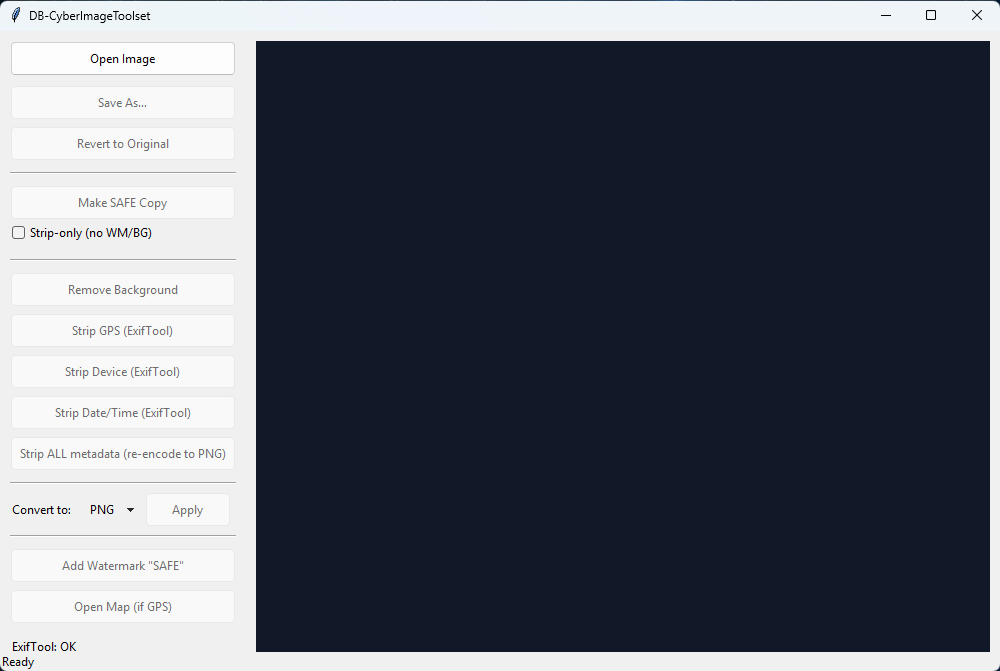
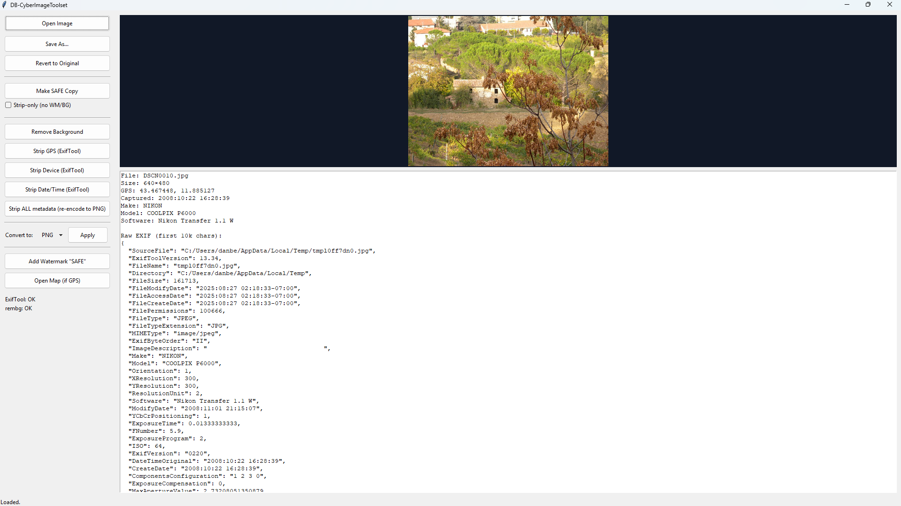

# DB-CyberImageToolset

> **Open one image. See what it leaks. Clean it. Save it.**  
> A tiny, offline desktop app (Tkinter + Pillow + ExifTool) to inspect and sanitize image metadata.




## Features
- 🔎 EXIF summary + raw JSON
- 🗺️ Open Map when GPS is present
- 🛡️ **SAFE**: strip GPS/Device/Date — with **Strip-only** option (no watermark / no background removal)
- 🧹 Optional background removal (if `rembg` installed)
- 🔁 Convert (PNG/JPEG/WEBP), Save, Revert

## Quick start
### Requirements
- Python 3.10+
- Pillow (required)
- rembg (optional)
- ExifTool (recommended) on PATH or binary in `tools/`

### Install
```bash
python -m pip install --upgrade pip
python -m pip install -r requirements.txt
# Optional:
# python -m pip install rembg
```


### ExifTool setup (place the whole folder under `tools/`)

This repo does **not** include ExifTool. Download it from https://exiftool.org/ and put it in `tools/`:

**Windows**
1. Download the Windows zip.
2. Extract it. If the main file is `exiftool(-k).exe`, rename it to `exiftool.exe`.
3. Copy **everything** into your project's `tools/` folder so you end up with:

```
tools/
  exiftool.exe            # required at top-level
  exiftool_files/         # if present
  ...
```

(If your download already has a subfolder layout, placing it as `tools/exiftool_files/...` also works — the app searches both.)

**macOS / Linux**
- Install via package manager (e.g., `brew install exiftool`, `apt install libimage-exiftool-perl`) **or**
- download the tar and put `exiftool` in `tools/`.

### Run
```bash
python tk_simple_tool.py
```

## License
MIT — see [LICENSE](LICENSE).


## Supported formats
- Open: **PNG, JPEG/JPG, WEBP, TIFF/TIF, BMP**  
- With optional plugin: **HEIC/HEIF/AVIF** (install `pillow-heif` — see below)  
- Save/Convert: **PNG, JPEG, WEBP**

### HEIC/HEIF/AVIF support
To open modern iPhone/HEIC images, install the optional plugin:
```bash
python -m pip install pillow-heif
```
On first import, the app registers the HEIF opener automatically:
```python
import pillow_heif
pillow_heif.register_heif_opener()
```
ExifTool can still strip metadata for HEIC files; the app uses ExifTool for GPS/Device/Date removal.
